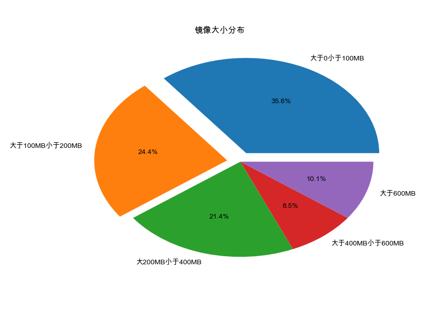
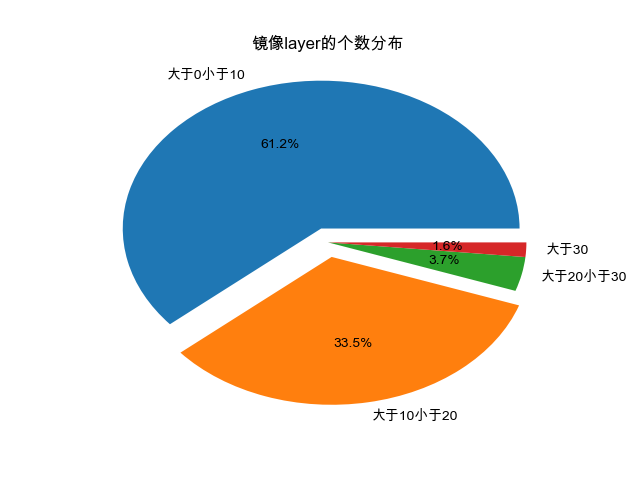
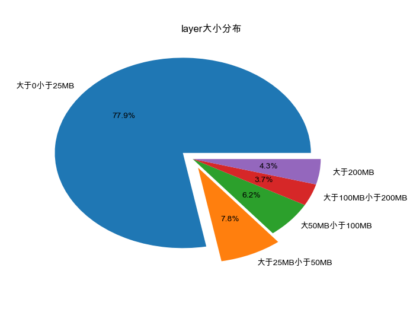

# About Docker Manifest
### 介绍
&nbsp;&nbsp;&nbsp;&nbsp;本项目从Docker Hub网站上抽取多个常用(Verified Publisher+Official Images+Linux+x86-64)Docker image的名称，并利用相关接口获取这些image的manifest信息用于进一步分析。

### 相关文件

1. ./data/image_info.csv : 与常用image有关的信息表，例如image_id，namespace，tag等等。
2. ./data/layer_info.csv : 与image所包含的layer有关的信息，如layer_id，size。
3. hrefs : 使用pickle包存储的List形式的常用image的网页超链接，爬虫对这些链接进行爬取，通过api获取image信息时也需要其中的某些信息。
4. download_through_api.py : image的一些常用信息可以通过调用docker hub的接口获得，例如namespace，reponame，tag，创建日期等等，在获取image的manifest时需要指出image的namespace，reponame和tag的信息，该脚本通过调用这一接口从而获取这些基本信息。
5. download_crawler.py : 某些image的信息无法通过api进行准确获取，只能进入其介绍页面进行获取，因此该脚本使用脚本直接进入介绍页面进行抓取。
6. name.txt : 通过对4，5两个脚本获得的信息进行综合之后得到的image的基本信息列表。
7. get_manifest.py : 使用docker的内置命令"docker manifest inspect -v name:tag"从服务器中获取image的manifest信息，并将关键信息抽取出来存入mysql数据库中。
8. analyse.py : 对数据进行分析并作图。

### 分析结果

| layer平均大小 | 最大layer层数 | 最小layer层数 | 平均layer层数 | 最大image大小 | 最小image大小 | 平均image大小 |
| :-----------: | :-----------: | :-----------: | :-----------: | :-----------: | :-----------: | :-----------: |
|   44.448MB    |      70       |       1       |      9.3      |  8156.689MB   |    0.001MB    |   415.229MB   |

---------

--------

---------
